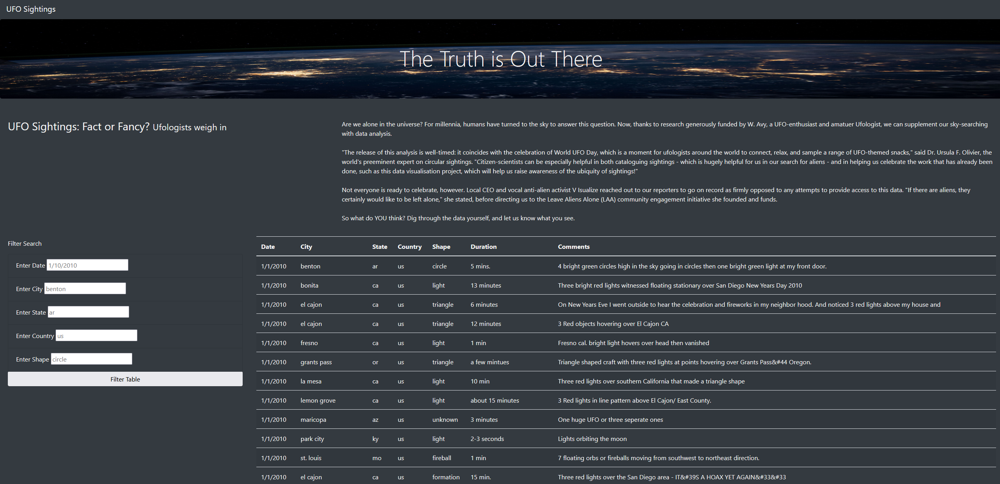
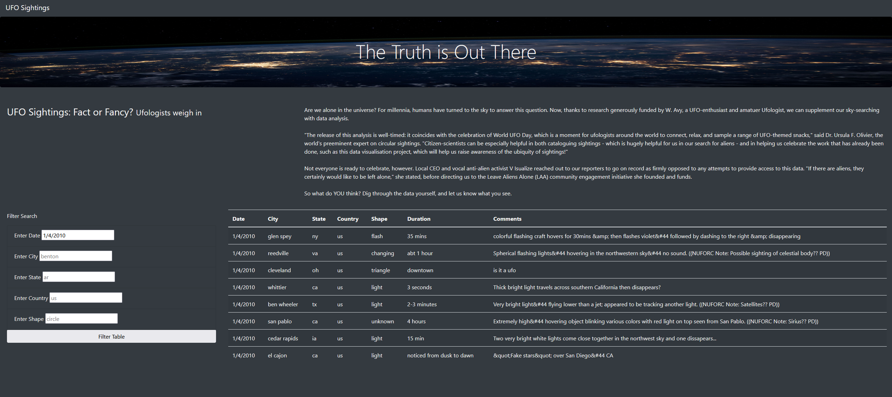
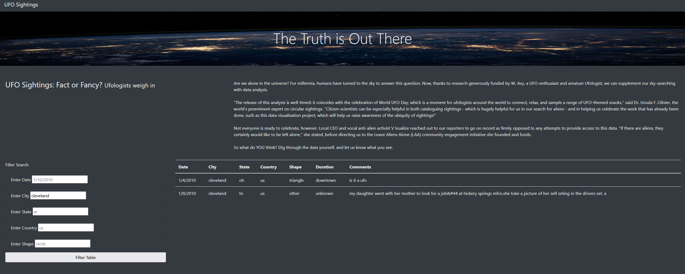
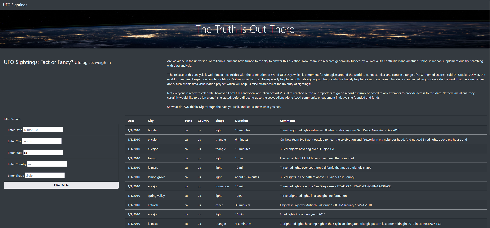
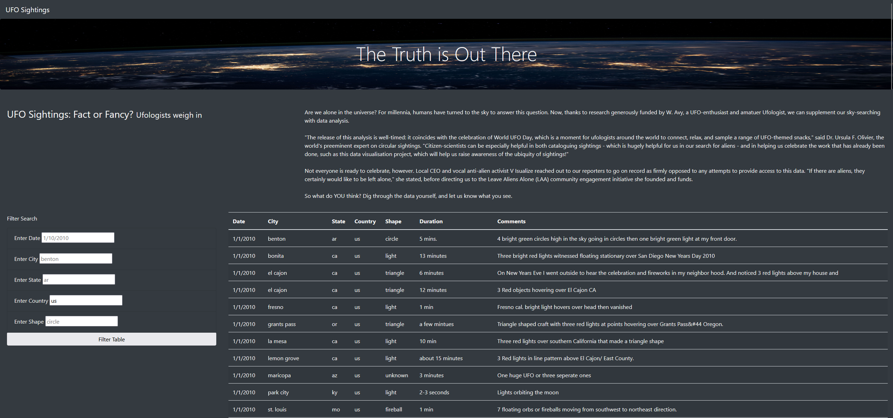
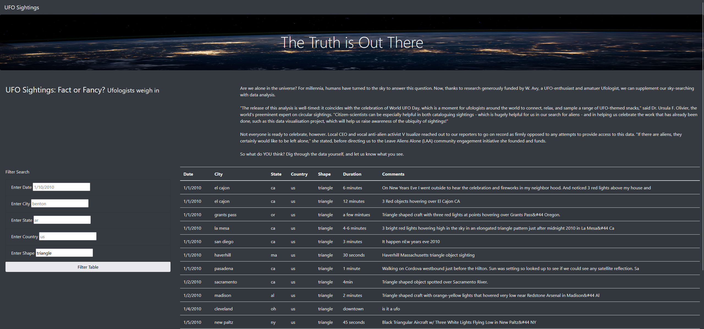
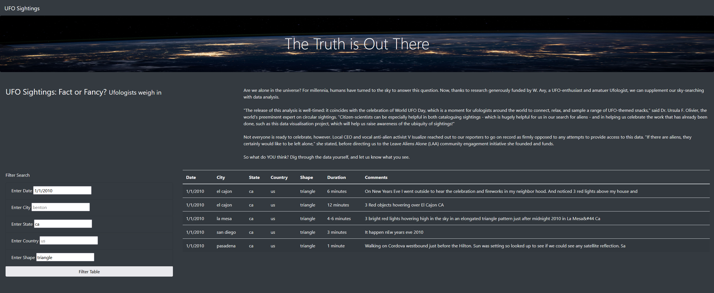
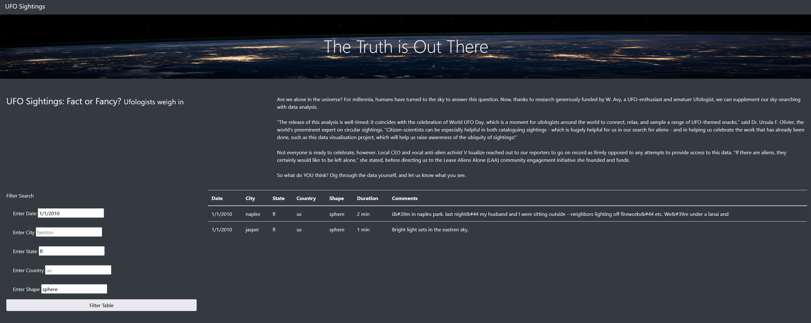

# UFO Sightings
## Overview of Project:

In UFO Sightings projects we are playing Dana who creates a webpage and dynamic table and add more filters for the date, city, state, country, and shape so that users can filter for multiple criteria at same time.

## Analysis:
Dana's goal is to create an interactive webpage that allows readers to parse the data around UFO sightings. She builds two things: the webpage that will allow users to view the data (HTML) and a dynamic table that will present it (JavaScript).

The modified UFO sightings website consists of dynamic table with filters for the date, city, state, country, and shape.

### Date Filter:

Upon entering the date of 1/4/2010 the table gets updated upon using filter table.

### City Filter:

Upon entering the city cleveland the table gets updated upon using filter table and shows only data from Cleveland city.

### State Filter:

Upon entering the state ca the table gets updated upon using filter table.

### Country Filter:

Upon entering the country as us, the table gets updated as shown in the picture below.

### Shape Filter:

Upon entering the triangle shape the table gets updated as below.

### Multiple Filters:

- When multiple filters are selected example when date 1/1/2010 was entered along with ‘ca’ state and triangle shape, table gets updated as below.

- Similarly, when date 1/1/2010 and ‘fl’ state with spehere shape in entered the table if filtered as below.

## Summary:

D3 is a JavaScript library that produces sophisticated and highly dynamic graphics in an HTML webpage enabling it to "listen" for events, such as a user clicking a button. Having a separate D3.js, app.js abd data.js keeps it clean. CSS allows customizing making it visually appealing and being able to configure to user needs.
